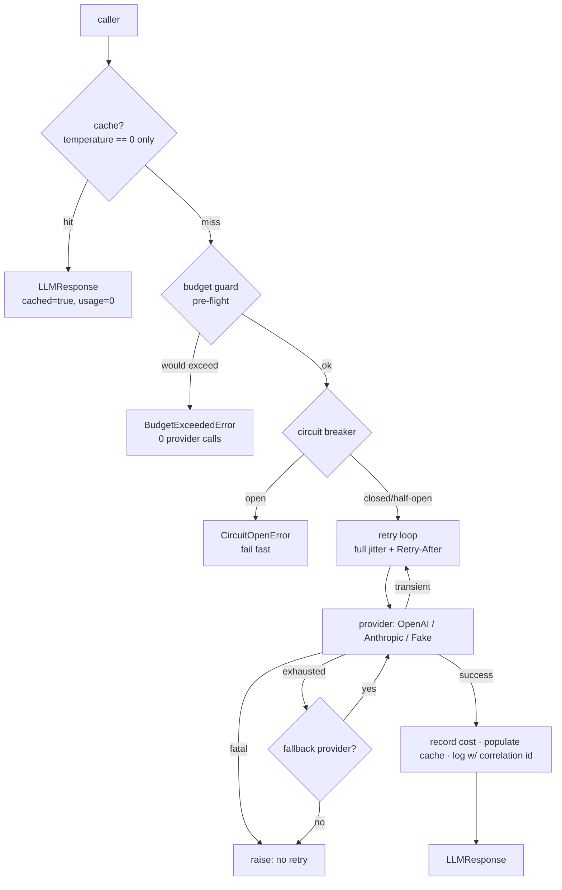

# Module 03 — LLM Integration (`llmkit`)

**Phase 3 of the roadmap · Weeks 13–20**

A provider-agnostic LLM client with the production behaviour that separates "I called the OpenAI API" from "I run an LLM service": retry, circuit breaking, fallback, caching, cost control, and typed output.

Everything runs offline. No API key is needed for any test or example.

```bash
python 03-llm-integration/examples/llmkit_ex_resilience.py   # start here
python 03-llm-integration/examples/llmkit_ex_concurrent.py   # then this
pytest 03-llm-integration/tests -q                           # 51 tests, 0.3s
```

---

## Why write this instead of using the SDK

In production you often *should* use the vendor SDK. This module implements the wire protocol by hand because:

- A "chat completion" turns out to be **one POST with a JSON body**. Once you've seen that, debugging it stops being guesswork.
- The retryable signals — status code, `Retry-After`, `x-request-id` — live in the HTTP response. SDKs hide them behind their own exception types, and you need them the moment you tune retry behaviour.
- `base_url` is configurable, and **vLLM, Ollama, Groq, Together and most self-hosted servers speak the OpenAI protocol exactly**. One class, one URL change, any of them.
- Zero new dependencies.

---

## Architecture



**Composition order is a design decision**, documented in `client.py`:

- **Breaker outside retry** — retrying inside an open circuit defeats the point, and the breaker should count one *logical call*, not one HTTP attempt. Resilience4j composes them identically.
- **Cache before budget** — a cache hit spends nothing, so it must not be charged against the cap.
- **Cost recorded after success only.**

---

## The failure-mode table

This table *is* the library. Everything else is plumbing.

| Error | Status | Retryable? | What the client does |
|---|---|---|---|
| `RateLimitError` | 429 | **Yes** | Back off, honouring `Retry-After` over its own curve |
| `TransientError` | 500/502/503/504, timeout, conn reset | **Yes** | Exponential backoff + full jitter |
| `AuthError` | 401/403 | No | Raise immediately — a bad key won't fix itself in 800ms |
| `InvalidRequestError` | 400/422 | No | Raise — retrying resends the same bad payload |
| `ContextLengthError` | 400 (body match) | No | Raise, but **recoverable**: drop turns, shrink RAG context, or route to a longer-context model |
| `ContentFilterError` | 400 (body match) | No | Raise — the same prompt will be refused again |
| `BudgetExceededError` | — | No | Raised **before** the call |
| `CircuitOpenError` | — | No | Fail fast; carries `retry_after` |

Getting this split wrong is expensive in both directions: retry a 401 three times and you've bought three guaranteed failures; *don't* retry a 429 and you fail requests that would have succeeded.

---

## Backoff: why jitter is not optional

```
sleep = random_uniform(0, min(cap, base * 2**attempt))
```

Without the random term, N clients that failed together retry together — and keep colliding. That's the thundering herd, and it's why naive `sleep(2 ** attempt)` makes an overloaded provider *worse*. Full jitter halves the expected wait while keeping the worst case bounded. ([AWS: Exponential Backoff and Jitter](https://aws.amazon.com/blogs/architecture/exponential-backoff-and-jitter/))

Also bounded by wall clock (`max_elapsed`), because 5 retries of a 30s timeout is a 2.5-minute request that some upstream gave up on long ago.

---

## The caching trap

**Caching an LLM response is only sound at `temperature=0`.**

Above zero the model is *supposed* to vary — that's what the parameter means. Cache it and you've frozen one draw of a sampling distribution. The user clicks "regenerate" and gets the same paragraph forever. It looks like a product bug, not a caching bug, so it takes weeks to find.

`is_cacheable(temperature)` encodes this rather than leaving it to folklore. The cache key hashes **every** output-affecting parameter — omit `max_tokens` and a `max_tokens=50` request gets served a `max_tokens=4000` answer.

Cache hits return `cached=True` with `usage` zeroed, so hit rate is observable and cached tokens are never double-counted against the provider invoice.

---

## Cost

```python
estimate_cost(Usage(1_000_000, 1_000_000), "gpt-4o-mini")  # $0.75
estimate_cost(Usage(1_000_000, 1_000_000), "gpt-4o")  # $12.50
```

**~17× spread.** Routing simple work (classification, extraction, routing itself) to the small model is usually the largest single cost win available, and it's a config change.

Output tokens cost 3–5× input tokens — which makes "be concise" in a system prompt a genuine cost lever, not a style preference.

`BudgetGuard` runs **pre-flight**. A post-hoc budget check is an invoice, not a guard. Note the honest limitation documented in `cost.py`: it's in-process, so a multi-replica deployment needs a shared Redis counter or each replica gets its own full budget.

---

## Structured output

The gap between "an LLM returns a string" and "my app needs `Invoice(total=Decimal)`" is where production LLM code actually breaks. `json.loads(response.text)` fails on prose preambles, markdown fences, trailing commas, Python literals, and silent truncation.

Four layers, cheapest first:

1. **Ask correctly** — embed the real `model_json_schema()`, so the prompt can't drift from the class that validates the reply.
2. **Extract** — fenced block, else outermost *balanced* span. String-aware, because a brace inside a string value breaks naive counting.
3. **Repair** — deliberately conservative. Aggressive repair *invents data*, which is worse than a clean failure.
4. **Bounded re-ask** — feed the assistant's bad output **and the Pydantic error** back. This is the layer people skip, and it's what takes a pipeline from ~95% to ~99.9%.

Truncated responses (`finish_reason == "length"`) fail immediately with the real cause instead of burning retries on a parse error that will recur.

---

## Java ↔ Python

| Java / Spring | Here |
|---|---|
| Resilience4j `Retry` | `retry.py` — `RetryPolicy`, full jitter |
| Resilience4j `CircuitBreaker` | `circuit.py` — same CLOSED/OPEN/HALF_OPEN vocabulary |
| Resilience4j `Bulkhead` | `asyncio.Semaphore` (see the concurrency example) |
| Resilience4j `TimeLimiter` | `asyncio.wait_for` / httpx `timeout` |
| Caffeine | `cache.py` — `LRUCache`, bounded by size *and* age |
| `RestTemplate` / `WebClient` | `httpx.Client` / `httpx.AsyncClient` |
| `CompletableFuture.allOf` | `asyncio.gather` |
| Jackson + Bean Validation | `structured.py` + Pydantic |
| Mockito | `FakeProvider` (a real implementation, not a proxy) |
| Micrometer counters | `CostTracker`, breaker + cache counters |

---

## Files

| File | What it's for |
|---|---|
| `types.py` | `Message`, `Usage`, `ToolCall`, `LLMResponse`, `LLMProvider`. The anti-corruption layer. |
| `errors.py` | The retryable/fatal taxonomy + `classify_status()`. **Read this first.** |
| `retry.py` | Full-jitter backoff, `Retry-After`, wall-clock budget, sync + async |
| `circuit.py` | CLOSED/OPEN/HALF_OPEN with an injectable clock |
| `cache.py` | Cache key, LRU+TTL, `RedisCache`, the temperature-0 guard |
| `cost.py` | Price table, token counting, `CostTracker`, `BudgetGuard` |
| `structured.py` | Text → validated Pydantic model, with bounded self-correction |
| `client.py` | `LLMClient` façade composing all of the above |
| `providers/fake.py` | Deterministic offline provider — the backbone of every test |
| `providers/openai.py` | Chat Completions + embeddings + SSE, on raw httpx |
| `providers/anthropic.py` | Messages API — structured to expose the wire differences |

### OpenAI vs Anthropic, on the wire

Structuring the two providers identically makes the real differences visible:

| Concern | OpenAI | Anthropic |
|---|---|---|
| Endpoint | `/chat/completions` | `/messages` |
| Auth | `Authorization: Bearer` | `x-api-key` |
| Versioning | URL path | `anthropic-version` header (**required**) |
| System prompt | first element of `messages[]` | **top-level `system` field** |
| `max_tokens` | optional | **required** |
| Content | a string | a **list of typed blocks** |
| Stream end | `data: [DONE]` sentinel | `message_stop` named event |

The system-prompt difference is the migration killer: Anthropic only accepts `user`/`assistant` in `messages[]`, so an inline system message is a 400. `split_system()` exists for exactly that.

---

## Going live

```bash
cp .env.example .env          # add OPENAI_API_KEY or ANTHROPIC_API_KEY
```

```python
from llmkit import build_client, user

client = build_client("openai", model="gpt-4o-mini", daily_budget_usd=5.00)
print(client.complete([user("Hello")]).text)
print(client.report())  # tokens, cost, cache hit rate, breaker state
```

Keep `daily_budget_usd` low while learning. The guard exists because a runaway agent loop at 3am is a real way to lose real money.

---

## Exit criteria

You're done with this module when you can:

1. Explain every retry, fallback, and breaker transition the resilience example prints.
2. Say which errors are retryable **and why**, without looking.
3. Explain why caching at `temperature=0.7` is a bug.
4. Justify why the breaker sits outside the retry loop.
5. Estimate the monthly cost of a feature from QPS and average token counts.

**Next:** [Module 04 — RAG](../04-rag/) builds retrieval on top of this client.
