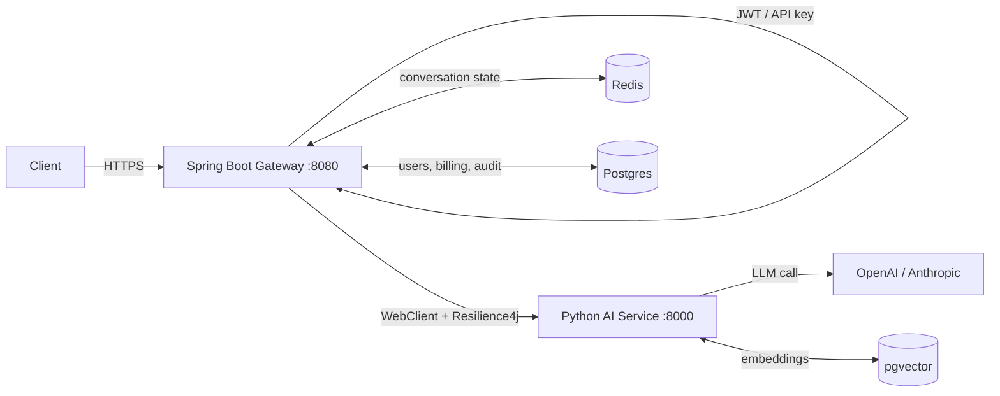

# Module 07 — Java Integration

**Phase 7 of the roadmap · Weeks 47–50**

This is where you stop competing with ML people and start competing on your own turf. Most GenAI candidates cannot design a resilient distributed system. You already can.

---

## The architecture



Two services, one clear seam.

---

## What belongs in Java vs Python

The decision table an interviewer wants you to have an opinion on:

| Concern | Where | Why |
|---|---|---|
| AuthN / AuthZ | **Java** | Spring Security exists and is battle-tested |
| Business logic, transactions | **Java** | it's already there, and it's ACID |
| Billing, quotas, audit | **Java** | money belongs next to the system of record |
| Conversation state | **Java** | keeps the Python service **stateless** |
| Rate limiting, API gateway | **Java** | edge concern, mature tooling |
| Orchestration across services | **Java** | this is what the JVM ecosystem is for |
| LLM calls, prompt management | **Python** | every provider ships Python first |
| RAG, chunking, embeddings | **Python** | LangChain/LlamaIndex/sentence-transformers |
| Agents, tool loops | **Python** | the ecosystem is a year ahead |
| Model inference, fine-tuning | **Python** | not a real choice |

**The governing principle:** keep the Python service **stateless**. All state lives in Java. That means the AI service scales, restarts and deploys freely without anyone losing a conversation — and it's why `ConversationService` lives on this side.

**When you don't need Python at all:** if you're only making chat calls and doing pgvector RAG, [Spring AI](https://docs.spring.io/spring-ai/reference/) does it natively. Adding a second language and a network hop to call an HTTP API is a cost you should be able to justify. Reach for Python when you need the ecosystem — agent frameworks, document parsing, evaluation, local models.

---

## Why WebFlux, not MVC

This service's whole job is to *wait* on a slow upstream and stream bytes back.

| | Spring MVC | WebFlux |
|---|---|---|
| Thread per in-flight LLM call | 1, held 2–20s | 0 while waiting |
| 200 concurrent calls | 200 threads (~1.6 GB stack) | a handful |
| SSE passthrough | awkward | `Flux` is natively a stream |

It's the same argument as `asyncio` in Python, for the same reason: the work is I/O wait, and waiting shouldn't cost a thread.

---

## The three integration patterns

| Pattern | Use when | Trade-off |
|---|---|---|
| **REST (sync)** | request/response under ~30s | simplest; ties up a connection |
| **SSE (streaming)** | user-facing chat | far better perceived latency; no retry after first byte |
| **Queue (async)** | batch, long agent runs, anything > 60s | survives restarts; needs a result channel |

Implemented here: REST and SSE. For the queue pattern the Python side already exposes `POST /v1/chat/async` + `GET /v1/jobs/{id}`; swap the in-memory store for Kafka or SQS and the contract is unchanged.

---

## Resilience: the rules that matter

### Retry only what can succeed

| Status | Retry? |
|---|---|
| 429, 502, 503, 504, connect/read timeout | **yes**, with exponential backoff **and jitter** |
| 400, 401, 402, 413, 422 | **never** — same request, same failure, 3× the latency |

Jitter is not optional: without it, every client that failed together retries together and keeps colliding. That's the thundering herd.

### 4xx must never open the circuit breaker

The single most common breaker misconfiguration. If client errors count as failures, **one caller sending malformed requests trips the breaker and takes a healthy upstream offline for everyone else.**

The breaker measures *upstream* health. Only 5xx and timeouts qualify. `application.yml` encodes this in `recordExceptions`, and `AiClientTest` asserts it: 10 consecutive 400s leave the breaker `CLOSED`.

### The timeout budget must nest correctly

```
Gateway time limiter   35s
  └─ Python LLM timeout  30s
       └─ Provider timeout  25s
```

Invert any two and the outer layer cancels work that was about to succeed — producing "timeouts" that leave **no trace in the upstream's logs**. `AiServiceProperties` refuses to start if `timeout-seconds` ≤ 30.

### Never retry a stream

Once the first chunk has reached the browser, replaying the request duplicates text the user already read. Streams fail fast; the client decides whether to start over. The breaker still applies, protecting the upstream from a flood of new attempts.

---

## Getting SSE passthrough right

```java
@PostMapping(path = "/stream", produces = MediaType.TEXT_EVENT_STREAM_VALUE)
public Flux<ServerSentEvent<String>> stream(...) { ... }
```

- **`Flux<ServerSentEvent<String>>`, not `Flux<String>`** — keeps the event *name*, so clients dispatch on `token`/`usage`/`error` rather than sniffing JSON keys.
- **Never `collectList()` or `block()`** anywhere in the chain. That buffers the whole answer and silently converts streaming back into a 20-second wait. It's the most common way an SSE passthrough is broken without anyone noticing, because it still *works* — just slowly.
- **Cancellation propagates.** A closed browser tab cancels the upstream request, so you stop paying for tokens nobody will read. Free with Reactor, lost the moment you buffer.
- **Heartbeats** keep proxies from closing an idle connection during a long first-token wait.

---

## Correlation IDs across the seam

```
Client → Gateway (generates or accepts X-Correlation-ID)
       → Python  (accepts it, echoes it, logs it)
       → Logs    (both services, one key)
```

Without this, debugging a distributed LLM call means grepping two services by timestamp and hoping. `AiClientTest` asserts the header is forwarded.

---

## Introducing GenAI into an existing monolith

You will be asked this. The answer is not "rewrite it".

1. **Strangler fig.** New AI endpoints go in a new service. The monolith calls it. Nothing existing is touched.
2. **Feature flags.** Ship the path disabled. Enable for internal users, then 1%, then 10%. An LLM feature *will* behave differently at scale.
3. **Shadow traffic.** Send real requests to the AI path, log the results, return the old behaviour. You get production-quality evaluation data with zero user risk — this is how you build a golden set that reflects reality.
4. **Fallback to the old path**, always. The breaker's fallback should be the pre-AI behaviour, not an error.
5. **Measure cost per request from day one.** Retrofitting attribution after launch is painful and you'll be asked for it in week two.

---

## Projects

### `spring-ai-gateway/`

The gateway above. Java 17, Spring Boot 3.3, WebFlux, Resilience4j, reactive Redis, Actuator + Prometheus.

| File | What it shows |
|---|---|
| `service/AiClient.java` | retry + breaker + timeout composition, typed fallback |
| `controller/ChatController.java` | SSE passthrough, error-envelope mapping |
| `service/ConversationService.java` | Redis history with TTL and trim, fully reactive |
| `config/GatewayConfig.java` | connection pool sized for slow upstreams |
| `config/AiServiceProperties.java` | validated config that fails fast on a bad timeout |
| `src/test/.../AiClientTest.java` | WireMock: happy path, 503 fallback, 4xx propagation, breaker-stays-closed, SSE |

```bash
cd spring-ai-gateway && mvn spring-boot:run     # needs the Python service on :8000
```

> **Verification note:** these sources were syntax-checked with `javac --release 17`; the only errors reported are unresolved third-party packages, which is expected without Maven resolving the dependency tree. They have **not** been compiled against real Spring jars — run `mvn test` to do that.

### Spring AI — no Python hop

When you only need chat plus pgvector RAG, skip the second service entirely:

```xml
<dependency>
  <groupId>org.springframework.ai</groupId>
  <artifactId>spring-ai-openai-spring-boot-starter</artifactId>
</dependency>
<dependency>
  <groupId>org.springframework.ai</groupId>
  <artifactId>spring-ai-pgvector-store-spring-boot-starter</artifactId>
</dependency>
```

```java
@Service
public class RagService {
    private final ChatClient chat;
    private final VectorStore store;

    public RagService(ChatClient.Builder builder, VectorStore store) {
        this.chat = builder.build();
        this.store = store;
    }

    // Structured output straight into a record -- the Java twin of
    // Pydantic-validated output in llmkit/structured.py.
    public record Answer(String text, List<String> sources) {}

    public Answer ask(String question) {
        List<Document> docs = store.similaritySearch(
                SearchRequest.query(question).withTopK(5));
        String context = docs.stream()
                .map(Document::getContent)
                .collect(Collectors.joining("\n\n"));

        return chat.prompt()
                .system("Answer only from the provided context. Cite sources.")
                .user(u -> u.text("Context:\n{context}\n\nQuestion: {q}")
                           .param("context", context)
                           .param("q", question))
                .call()
                .entity(Answer.class);
    }

    // Streaming is a Flux, so it drops straight into a WebFlux controller.
    public Flux<String> askStreaming(String question) {
        return chat.prompt().user(question).stream().content();
    }
}
```

**Spring AI vs LangChain4j:** Spring AI if you're already on Spring Boot — autoconfiguration, Actuator metrics, and the same `ChatClient` abstraction across providers. LangChain4j if you want a richer agent/tool ecosystem and don't mind wiring it yourself. Both are production-viable; neither matches Python's breadth for agents and document processing.

---

## Exit criteria

1. You can whiteboard the hybrid architecture and defend every boundary.
2. You can state which errors are retryable and which must not open the breaker.
3. You can explain the timeout-nesting rule and what breaks when it's inverted.
4. You can name the mistake that silently un-streams an SSE passthrough.
5. You can describe introducing GenAI into a monolith without a rewrite.

**Next:** [Module 08 — Interview Prep](../08-interview-prep/)
